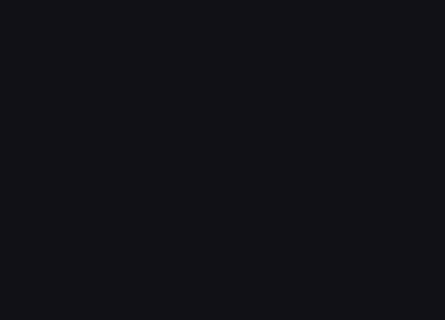

#My first SVG Animation
This is an animation of the logo of the company- monstar-lab.
This animation reference animeJS official website
http://animejs.com/

 
Below is the animation steps
#First
Code html and css

#Second
Code the logo to SVG. Note that sketch directly derived svg can not be used directly.
We need the PATH of the logo-svg . So,this is the key.

#Animate
Use the animejs ,we can make the logo antmated.